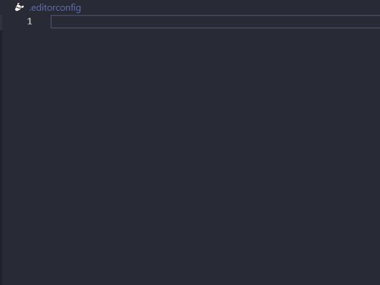

<p align="center">
    <h1 align="center"> Criação de snippets</h1>
    <h3 align="center"> Snippets são códigos que foram preparados anteriormente acelerando assim o processo para a utilização futura</h2>
</p>

<div align="center" >
    
    </div>

- Criando um arquivo .editorconfig

```json
"Editor config": {
  "prefix": "editorconfig",
  "body": [
   "root = true",
   "[*]",
   "charset = utf-8",
   "end_of_line = lf",
   "insert_final_newline = true",
   "trim_trailing_whitespace = true",
   "indent_style = space",
   "indent_size = 2",
   "max_line_length = 120"
  ],
  "description": "insta editorconfig"
}
```

---

- Criando server padrão

```json
"Server.ts default": {
    "prefix": "server-default",
    "body": [
      "import { app } from './app';",
      "import { config } from 'dotenv';",
      "",
      "config();",
      "const port = process.env.PORT || 3333;",
      "",
      "app.listen(port, () => console.log(`Server rodando na porta: trocar{port}`));",
    ],
    "description": "insta editorconfig"
}
```

---

- Criando app com as rotas incluso

```json
"app.ts with routes": {
    "prefix": "app-with-routes",
    "body": [
      "import express, { Router } from 'express';",
      "",
      "const app = express();",
      "const router = Router();",
      "",
      "app.use(express.json());",
      "router.get('', () => console.log('server is running'));",
      "",
      "app.use(router);",
      "",
      "export { app };",
    ],
    "description": "default app.ts"
  }
```

---

- Criando app utilizando outras rotas

```json
"app.ts with multiple routes": {
    "prefix": "app-call-routes",
    "body": [
      "import express from 'express';",
      "import trocar1 from './trocar2';",
      "",
      "const app = express();",
      "app.use(express.json());",
      "app.use(trocar1);",
      "",
      "export { app };"
    ],
    "description": "big app.ts"
  }
```

---

- Criando página de rotas padrão

```json
"router.ts default": {
    "prefix": "routes-default",
    "body": [
      "import { Router } from 'express';",
      "import trocar1 from './trocar2'';",
      "",
      "const routes = Router();",
      "",
      "routes.post('trocar3', trocar1.trocar4);",
      "export { routes };"
    ],
    "description": "default routes.ts"
  }
```

---

- Criando um arquivo controller padrão

```json
"controller.ts default": {
    "prefix": "controller-default",
    "body": [
      "import { Request, Response } from 'express';",
      "",
      "class trocar1 {",
      "trocar2",
      "}",
      "",
      "export default new trocar3();"
    ],
    "description": "default controller.ts"
  }
```

---

- Criando um arquivo service de ação única

```json
"service.ts only action": {
    "prefix": "service-only-function",
    "body": [
      "class trocar1 {",
      "\tpublic execute(): Promise<trocar2> {",
      "\t\ttry {",
      "",
      "\t\t} catch (error) {",
      "",
      "\t\t}",
      "\t}",
      "}",
      "",
      "export default new trocar1().execute;"
    ],
    "description": "only function service.ts"
  }
```

---

- Criando um arquivo service padrão

```json
"service.ts default": {
    "prefix": "service-multiple-function",
    "body": [
      "import { trocar1 } from './trocar2Repository';",
      "",
      "class trocar2 {",
      "\tprivate readonly repository: trocar1;",
      "",
      "\tconstructor() {",
      "\t\tthis.repository = new trocar1();",
      "\t}",
      "",
      "\tpublic async trocar3(): Promise<trocar4> {",
      "",
      "\t}",
      "",
      "}",
      "",
      "export default new trocar2();",
    ],
    "description": "multiple function service.ts"
  }
```

---

- Criando um arquivo de acesso para o banco de dados

```json
"repository.ts default": {
    "prefix": "repository-default",
    "body": [
      "class trocar1 {",
      "\tprivate repository = trocar2;",
      "",
      "\tpublic async trocar3(): Promise<trocar4> {",
      "",
      "\t}",
      "}",
      "",
      "export default trocar1;",
    ],
    "description": "default repository.ts"
  }
```

---

- Criando um arquivo para códigos reutilizáveis pelo projeto

```json
"utils.ts default": {
    "prefix": "utils-default",
    "body": [
      "class UtilsService {",
      "",
      "}",
      "",
      "export default new UtilsService();",
    ],
    "description": "default utilsService.ts"
  }
```

---

- Criando função de teste padrão

```json
"test.ts default": {
    "prefix": "test-default",
    "body": [
      "describe('$1', () => {",
      "\tit('$2', async () => {",
      "",
      "\t\texpect($3).toBe($4);",
      "\t});",
      "});",
    ],
    "description": "Log output to console"
  }
```
